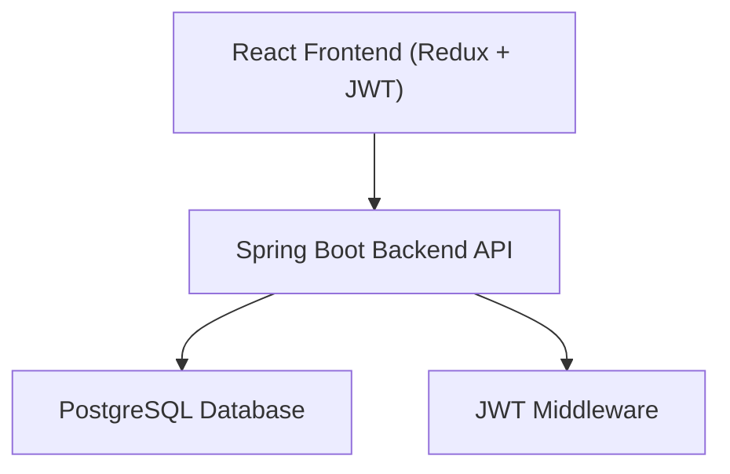
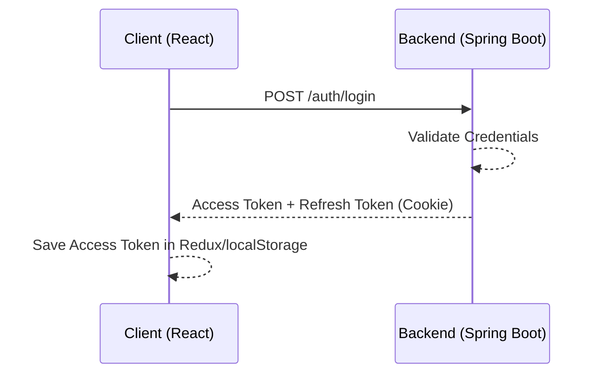
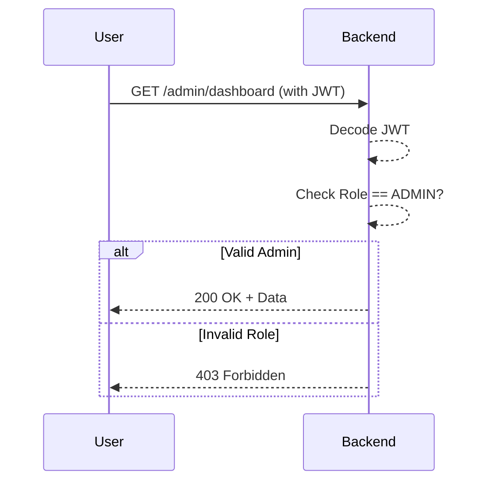
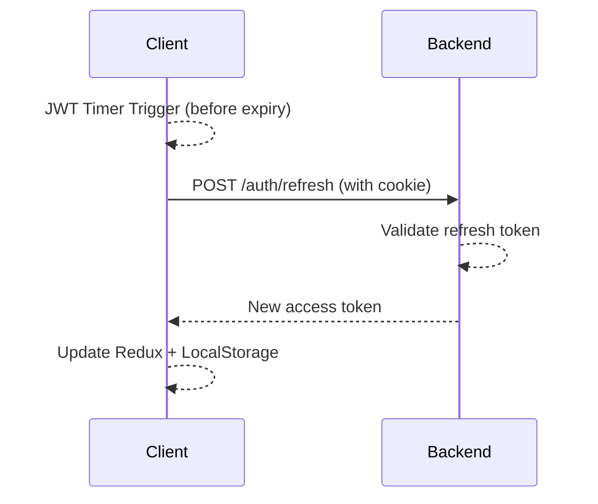
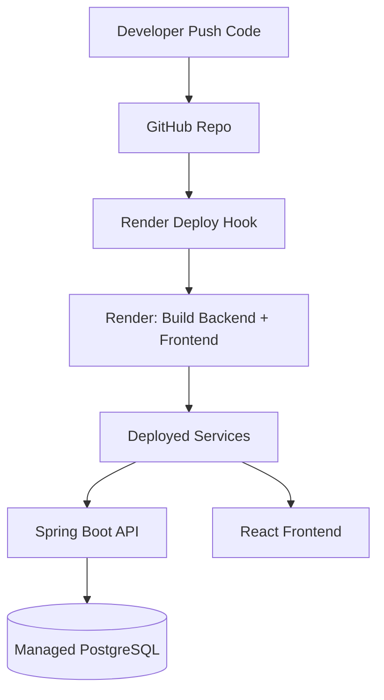

# 🔐 Fullstack JWT Auth System – Spring Boot + React + PostgreSQL

A full-featured secure system with:

- 🔐 JWT Authentication + Refresh Token
- 🛂 Role-based Access Control (RBAC)
- ♻️ Auto Access Token Refresh (React + Redux)
- ⚛️ React + Redux frontend
- ☕ Spring Boot backend (with Spring Security & JPA)
- 🐘 PostgreSQL Database
- ☁️ Cloud-ready for Render, Railway, Fly.io

---

## 📦 Tech Stack

| Layer      | Tech                            |
|------------|---------------------------------|
| Frontend   | React + Redux + Axios           |
| Backend    | Spring Boot + Spring Security   |
| Auth       | JWT + Refresh Token (HttpOnly)  |
| Database   | PostgreSQL                      |
| Deploy     | Docker                          |

---

## 🧱 System Architecture Diagram



---

## 🔐 JWT Auth Flow



---

## 🛂 Role-Based Access Flow



---

## ♻️ Refresh Token Lifecycle



---

## ⚙️ CI/CD Deployment (Render)



---

## 🚀 Local Dev Setup

```bash
git clone https://github.com/your-username/fullstack-auth-app.git
cd fullstack-auth-app

# Run with Docker
docker-compose up --build
```

### 💻 Access URLs

| Service   | URL                         |
|-----------|-----------------------------|
| Frontend  | http://localhost:3000       |
| Backend   | http://localhost:8080       |
| Swagger   | http://localhost:8080/swagger-ui.html |

---

## 🔑 API Endpoints

| Method | Endpoint           | Auth     | Description            |
|--------|--------------------|----------|-------------------------|
| POST   | `/auth/register`   | ❌ Public | Register new user      |
| POST   | `/auth/login`      | ❌ Public | Login, get token       |
| POST   | `/auth/refresh`    | ✅ Cookie | Refresh access token   |
| POST   | `/auth/logout`     | ✅ Cookie | Logout, clear cookie   |
| GET    | `/users`           | ✅ USER   | Get all users          |
| GET    | `/admin/dashboard` | ✅ ADMIN  | Admin only route       |

---

## 📁 Project Structure

```bash
springboot-postgres-docker/
├── backend/
│   ├── src/main/java/com/example/demo/
│   │   ├── controller/
│   │   ├── entity/
│   │   ├── dto/
│   │   ├── repository/
│   │   ├── service/
│   │   ├── security/
│   │   └── DemoApplication.java
│   ├── resources/
│   │   └── application.properties
│   └── Dockerfile
├── frontend/
│   ├── src/
│   │   ├── store/
│   │   ├── App.jsx
│   │   ├── Login.jsx
│   │   ├── Register.jsx
│   │   └── UserList.jsx
│   └── Dockerfile
├── docker-compose.yml
└── README.md
```